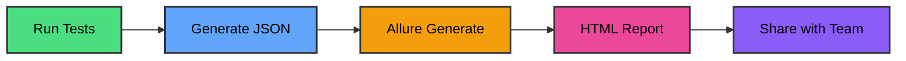

# <twemoji-rocket/> Boosting Your Team's Clarity

## in Test Automation with <span class="text-glow font-bold text-yellow-400">Allure Reporting</span>

<div class="absolute bottom-10 left-10 text-left">
  <p class="text-xl opacity-80">Anastasios Tilsizoglou</p>
  <p class="text-sm opacity-60">Senior SDET @ Chubb</p>
  <p class="text-xs opacity-50">~7 years in test automation</p>
</div>

<div class="abs-br m-6 flex gap-2">
  <a href="https://github.com/tasostilsi" target="_blank" alt="GitHub"
    class="text-xl icon-btn opacity-50 !border-none !hover:text-white">
    <carbon-logo-github />
  </a>
</div>

---
layout: center
class: text-center
---


---
layout: center
class: text-center
---

# <twemoji-elephant class="text-yellow-400"/> The Elephant in the Room

<div class="text-2xl mt-10 mb-8 font-bold text-yellow-300">
What is the biggest challenge your team faces<br/>with test result visibility?
</div>

<div class="flex justify-center">
  
</div>

<p class="mt-6 text-sm opacity-70">Scan to share your answer</p>

---
layout: center
class: text-center
---

# <fa6-solid-user-check/> Your Experience

<div class="text-2xl mt-10 mb-8 font-bold text-yellow-300">
What is your experience level with Allure Reporting?
</div>

<div class="space-y-4 text-xl">
<p><fa6-solid-question class="text-gray-400"/> Never heard of it</p>
<p><fa6-solid-ear-listen class="text-blue-400"/> Heard of it but never used it</p>
<p><fa6-solid-flask class="text-yellow-400"/> Tried it a bit</p>
<p><fa6-solid-star class="text-green-400"/> Use it regularly</p>
</div>

<div class="flex justify-center mt-8">
  
</div>

<p class="mt-6 text-sm opacity-70">Scan to share your experience</p>

---
layout: two-cols
---

# <fa6-solid-chart-pie/> Current Tools?

<div class="mt-10">

### Which tools are you using?

- <fa6-solid-terminal class="text-gray-400"/> Console Logs
- <fa6-solid-file-code class="text-blue-400"/> Default framework reports
- <fa6-solid-chart-bar class="text-green-400"/> Extended Reports
- <fa6-solid-server class="text-purple-400"/> ReportPortal
- <fa6-solid-fire class="text-orange-400"/> Allure reports
- <fa6-solid-ellipsis class="text-yellow-400"/> Other

</div>

::right::

<div class="flex items-center justify-center h-full">
  
</div>

---
layout: center
---

# <twemoji-open-book/> Once Upon a Time...

<div class="text-center space-y-6 mt-12 text-xl">

<p><fa6-solid-rocket class="text-green-400"/> Built test automation from scratch</p>

<p><fa6-solid-code class="text-blue-400"/> Team had Playwright + TypeScript</p>

<p><fa6-solid-circle-check class="text-yellow-400"/> POCs showed good product fit</p>

</div>

---
layout: center
---

# <fa6-solid-calendar-days/> Every Day...

<div class="text-center space-y-6 mt-12 text-xl">

<p><fa6-brands-java class="text-orange-400"/> Built separate <span class="text-yellow-300 font-bold">Java REST Assured</span> for API testing</p>

<p><fa6-solid-code-compare class="text-red-400"/> Two frameworks. Two languages. Two different worlds.</p>

<p><fa6-solid-question class="text-purple-400"/> Why? Because that's where my experience was</p>

</div>

---
layout: center
class: text-center
---

# <fa6-solid-bolt class="text-yellow-400"/> Until One Day...

<div class="text-9xl font-bold text-yellow-400 my-8">
1200+
</div>

<div class="space-y-4 text-xl">

<p><fa6-solid-clock/> After 1 year: needed to migrate all tests</p>

<p><fa6-solid-arrow-right/> Java REST Assured → Playwright TypeScript</p>

<p><fa6-solid-lightbulb class="text-yellow-400"/> Should have built on existing archetype</p>

</div>

<div class="text-3xl font-bold text-red-400 mt-10">
<fa6-solid-triangle-exclamation/> Spoiler Alert: Wrong decision
</div>

---
layout: center
---

# <fa6-solid-bug/> The REAL Problem

<p class="text-xl italic text-blue-300 text-center mb-8">It wasn't just about frameworks...</p>

<div class="space-y-5 text-lg">

<p><fa6-solid-file-lines class="text-gray-400"/> ReportNG for Java, default Playwright reports</p>

<p><fa6-solid-magnifying-glass class="text-red-400"/> Neither was good for investigating failures</p>

<p><fa6-solid-users-slash class="text-orange-400"/> Neither was readable for managers</p>

<p><fa6-solid-link-slash class="text-yellow-400 font-bold"/> No unified way to update Jira automatically</p>

</div>

<div class="text-2xl font-bold text-red-400 text-center mt-10">
<fa6-solid-eye-slash/> Teams, managers, stakeholders — all blind
</div>

---
layout: center
---

# <fa6-solid-map/> Because of That... We Searched

<div class="mt-8 space-y-4 text-lg">

<p><fa6-solid-check class="text-green-400"/> Works with Java and TypeScript/Playwright</p>

<p><fa6-solid-check class="text-green-400"/> Easy to investigate test failures</p>

<p><fa6-solid-check class="text-green-400"/> Visual and stakeholder-friendly</p>

<p><fa6-solid-check class="text-green-400"/> Standardized output for automation</p>

<p><fa6-solid-check class="text-green-400"/> Open-source and well-supported</p>

</div>

<div class="absolute bottom-10 right-10 text-6xl opacity-20">
<fa6-solid-compass/>
</div>

---
layout: two-cols
---

# <fa6-solid-wand-magic-sparkles/> What is Allure?

<div class="mt-4">

### *"A flexible, lightweight test report tool"*

<div class="mt-8 space-y-3">

<p><fa6-solid-puzzle-piece class="text-purple-400"/> Framework-agnostic</p>

<p><fa6-solid-palette class="text-pink-400"/> Beautiful, interactive HTML</p>

<p><fa6-solid-circle-info class="text-blue-400"/> Rich test execution details</p>

<p><fa6-solid-list-ol class="text-green-400"/> Step-by-step breakdown</p>

<p><fa6-solid-paperclip class="text-yellow-400"/> Attachments support</p>

<p><fa6-solid-chart-line class="text-orange-400"/> Historical trends</p>

</div>
</div>

::right::

<div class="flex items-center justify-center h-full">
  
</div>

---
layout: center
class: text-center
---

# <fa6-solid-diagram-project/> How Allure Works

<div class="flex justify-center mt-4 mb-6">



</div>

<div class="grid grid-cols-3 gap-4 text-center px-20">
<div class="bg-green-500/20 p-4 rounded-lg border border-green-500/30">
  <fa6-solid-play class="text-3xl text-green-400 mb-2"/>
  <p class="text-sm font-semibold">Execute Tests</p>
</div>
<div class="bg-blue-500/20 p-4 rounded-lg border border-blue-500/30">
  <fa6-solid-file-code class="text-3xl text-blue-400 mb-2"/>
  <p class="text-sm font-semibold">Collect Results</p>
</div>
<div class="bg-orange-500/20 p-4 rounded-lg border border-orange-500/30">
  <fa6-solid-chart-bar class="text-3xl text-orange-400 mb-2"/>
  <p class="text-sm font-semibold">Beautiful Report</p>
</div>
</div>

---
layout: center
---

# <fa6-solid-layer-group/> Key Features

<div class="grid grid-cols-2 gap-8 mt-10">
<div>

### <fa6-solid-list-check class="text-green-400"/> For Engineers
- Detailed step execution
- Screenshot attachments
- Log file integration
- Video recordings
- Network traffic capture

</div>
<div>

### <fa6-solid-chart-pie class="text-blue-400"/> For Managers
- Visual dashboards
- Pass/Fail trends
- Flaky test detection
- Duration analytics
- Historical comparison

</div>
</div>

---

# <fa6-solid-image/> Allure Dashboard Example

<div class="mt-8 space-y-6">

### <fa6-solid-chart-line class="text-yellow-400"/> Live Demo

<div class="bg-blue-500/20 p-6 rounded-lg border-2 border-blue-400">
  <p class="text-2xl mb-4">🔗 Check out a real Allure Report:</p>
  <a href="https://allure-examples.github.io/jest-npm-cjs-js/13/index.html" target="_blank" class="text-blue-300 text-xl underline hover:text-blue-200">
    allure-examples.github.io
  </a>
</div>

### <fa6-solid-list-check class="text-green-400"/> What You'll See:

<div class="grid grid-cols-2 gap-4 text-lg">
<div>

- 📊 Overview Dashboard
- 📈 Graphs & Trends
- 🧪 Test Suites

</div>
<div>

- ⏱️ Timeline View
- 📎 Attachments
- 🔍 Detailed Steps

</div>
</div>

</div>

---
layout: two-cols
---

# <fa6-solid-code/> Setup: Step 1

### <fa6-solid-download class="text-green-400"/> Install Dependencies

```bash
# Install Allure reporter
npm install --save-dev \
  @playwright/test allure-playwright
```

<div class="mt-6">
<fa6-solid-circle-info class="text-blue-400"/> Works with Playwright, Jest, Cypress, and more!
</div>

::right::

<div class="mt-20">

### <fa6-solid-puzzle-piece/> Supported Frameworks

<div class="space-y-3 mt-6">

- <fa6-brands-node-js class="text-green-500"/> Playwright
- <fa6-solid-check class="text-yellow-500"/> Jest
- <fa6-solid-check class="text-cyan-500"/> Cypress
- <fa6-solid-code class="text-orange-500"/> Selenium
- <fa6-brands-java class="text-red-500"/> JUnit/TestNG

</div>
</div>

---

# <fa6-solid-gear/> Setup: Step 2

### <fa6-solid-file-code class="text-blue-400"/> Configure playwright.config.ts

```typescript
export default defineConfig({
  reporter: [
    ['allure-playwright', {
      outputFolder: 'allure-results'
    }]
  ],
  // ... other config
});
```

<div class="mt-6 grid grid-cols-2 gap-4">
<div class="bg-blue-500/20 p-3 rounded">
  <fa6-solid-folder class="text-blue-400"/> Results stored in <code>allure-results/</code>
</div>
<div class="bg-green-500/20 p-3 rounded">
  <fa6-solid-circle-check class="text-green-400"/> Auto-captures screenshots & logs
</div>
</div>

---
---

# <fa6-solid-terminal/> Setup: Step 3

### <fa6-solid-play class="text-green-400"/> Generate & View Report

```bash
# Run your tests
npx playwright test

# Generate report
allure generate allure-results -o allure-report

# Open in browser
allure open allure-report
```

<div class="mt-6 flex gap-4">
<div class="flex-1 bg-purple-500/20 p-4 rounded">
  <fa6-solid-rocket class="text-2xl text-purple-400 mb-2"/>
  <p class="text-sm">Auto-opens in browser</p>
</div>
<div class="flex-1 bg-pink-500/20 p-4 rounded">
  <fa6-solid-globe class="text-2xl text-pink-400 mb-2"/>
  <p class="text-sm">Interactive & searchable</p>
</div>
<div class="flex-1 bg-orange-500/20 p-4 rounded">
  <fa6-solid-share-nodes class="text-2xl text-orange-400 mb-2"/>
  <p class="text-sm">Easy to share</p>
</div>
</div>

---
layout: center
class: text-center
---

# <fa6-solid-graduation-cap/> Quiz Time!

<div class="text-2xl mt-10 mb-8 font-bold text-yellow-300">
Which annotation is used to add a custom label in an Allure report?
</div>

<div class="space-y-4 text-xl">
<p><fa6-solid-a class="text-blue-400"/> @allure.step</p>
<p><fa6-solid-b class="text-green-400"/> @allure.label</p>
<p><fa6-solid-c class="text-yellow-400"/> @allure.description</p>
<p><fa6-solid-d class="text-purple-400"/> @allure.link</p>
</div>

<div class="flex justify-center mt-8">
  
</div>

---
layout: two-cols
---

# <fa6-solid-cloud/> CI/CD Integration

### <fa6-brands-github class="text-purple-400"/> GitHub Actions Example

```yaml
name: Run Tests
run: npx playwright test

name: Generate Allure Report
run: allure generate allure-results

name: Publish Report
uses: peaceiris/actions-gh-pages@v3
```

::right::

<div class="mt-20">

### <fa6-solid-trophy class="text-yellow-400"/> Benefits

<div class="space-y-4 mt-8">

<p><fa6-solid-check class="text-green-400"/> Historical trends across builds</p>

<p><fa6-solid-check class="text-green-400"/> Automatic report hosting</p>

<p><fa6-solid-check class="text-green-400"/> Easy sharing with team</p>

</div>
</div>

---
layout: center
---

# <fa6-solid-bolt-lightning/> Real Impact

<div class="grid grid-cols-2 gap-12 mt-12">
<div>

### <fa6-solid-xmark class="text-red-400"/> Before Allure
<div class="mt-6 space-y-3 text-lg opacity-70">
<p><fa6-solid-clock/> ~3-10 minutes to identify issue</p>
<p><fa6-solid-terminal/> Dig through console logs</p>
<p><fa6-solid-question/> Unclear failure reasons</p>
<p><fa6-solid-users-slash/> Managers in the dark</p>
</div>

</div>
<div>

### <fa6-solid-check class="text-green-400"/> After Allure
<div class="mt-6 space-y-3 text-lg">
<p><fa6-solid-rocket class="text-green-400"/> 2 min to identify issue</p>
<p><fa6-solid-image class="text-blue-400"/> Visual screenshots + logs</p>
<p><fa6-solid-list-check class="text-yellow-400"/> Clear step-by-step trace</p>
<p><fa6-solid-chart-pie class="text-purple-400"/> Stakeholder dashboards</p>
</div>

</div>
</div>

<div class="text-center mt-10 text-3xl font-bold">
<fa6-solid-arrow-down class="text-yellow-400"/> <span class="text-green-400">93% faster</span> debugging!
</div>

---
---

# <fa6-solid-lightbulb/> Advanced Features

<div class="grid grid-cols-2 gap-6 mt-8">
<div class="bg-gradient-to-br from-purple-500/20 to-pink-500/20 p-6 rounded-lg">

### <fa6-solid-tags class="text-purple-400"/> Categorization
- Custom labels
- Feature tagging
- Severity levels
- Owner assignment

</div>
<div class="bg-gradient-to-br from-blue-500/20 to-cyan-500/20 p-6 rounded-lg">

### <fa6-solid-shuffle class="text-blue-400"/> Flaky Tests
- Auto-detection
- Retry tracking
- Success rate %
- Historical patterns

</div>
<div class="bg-gradient-to-br from-green-500/20 to-emerald-500/20 p-6 rounded-lg">

### <fa6-solid-link class="text-green-400"/> Integrations
- Jira issues
- Test case links
- Documentation
- Bug trackers

</div>
<div class="bg-gradient-to-br from-orange-500/20 to-red-500/20 p-6 rounded-lg">

### <fa6-solid-chart-gantt class="text-orange-400"/> Timeline View
- Parallel execution
- Thread visualization
- Duration breakdown
- Bottleneck detection

</div>
</div>

---
layout: center
class: text-center
---

# <fa6-solid-square-poll-vertical/> Which feature do you find most useful?

<div class="grid grid-cols-2 gap-4 mt-8 text-lg">
<div>

- <fa6-solid-list-check class="text-green-400"/> Step-by-step execution
- <fa6-solid-paperclip class="text-blue-400"/> Attachments (screenshots/logs)
- <fa6-solid-shuffle class="text-yellow-400"/> Flaky test detection

</div>
<div>

- <fa6-solid-cloud class="text-purple-400"/> CI/CD integration
- <fa6-solid-chart-pie class="text-pink-400"/> Visual dashboards
- <fa6-solid-chart-line class="text-orange-400"/> History and Trends Analysis

</div>
</div>

<div class="flex justify-center mt-8">
  
</div>

---
---

# <fa6-solid-trophy/> Why Choose Allure

<div class="grid grid-cols-2 gap-6 mt-8">
<div class="bg-blue-500/20 p-5 rounded-lg border-l-4 border-blue-400">

### <fa6-solid-code class="text-blue-400"/> For Engineers
- Faster debugging (30min → 2min)
- Step-by-step execution
- Easy to add custom info

</div>
<div class="bg-green-500/20 p-5 rounded-lg border-l-4 border-green-400">

### <fa6-solid-users class="text-green-400"/> For Teams
- Framework-agnostic
- Historical trends
- Flaky test tracking

</div>
<div class="bg-purple-500/20 p-5 rounded-lg border-l-4 border-purple-400">

### <fa6-solid-user-tie class="text-purple-400"/> For Managers
- Clear visual reports
- Understandable metrics
- CI/CD integration

</div>
<div class="bg-orange-500/20 p-5 rounded-lg border-l-4 border-orange-400">

### <fa6-solid-heart class="text-orange-400"/> For Everyone
- Open-source and free
- Active community
- Extensible & customizable

</div>
</div>

---
layout: center
class: text-center
---

# <fa6-solid-graduation-cap/> Final Quiz!

<div class="text-2xl mt-10 mb-8 font-bold text-yellow-300">
Which command is used to open the Allure HTML report?
</div>

<div class="space-y-4 text-xl">
<p><fa6-solid-a class="text-blue-400"/> allure serve</p>
<p><fa6-solid-b class="text-green-400"/> npx playwright test</p>
<p><fa6-solid-c class="text-yellow-400"/> allure open</p>
<p><fa6-solid-d class="text-purple-400"/> npm run report</p>
</div>

<div class="flex justify-center mt-8">
  
</div>

---
layout: center
class: text-center
---

# <fa6-solid-chart-simple/> One More Thing...

<div class="text-2xl mt-10 mb-8">
Do you plan to implement Allure in your project?
</div>

<div class="space-y-4 text-xl">
<p><fa6-solid-check class="text-green-400"/> Yes, immediately!</p>
<p><fa6-solid-clock class="text-yellow-400"/> Yes, but need to plan</p>
<p><fa6-solid-lightbulb class="text-orange-400"/> Maybe, need more info</p>
<p><fa6-solid-xmark class="text-red-400"/> No, not right now</p>
<p><fa6-solid-question class="text-purple-400"/> Already using it!</p>
</div>

<div class="flex justify-center mt-8">
  
</div>

---
layout: center
background: 'https://images.unsplash.com/photo-1451187580459-43490279c0fa?w=1920&q=80'
class: text-center
---

# <twemoji-party-popper/> Thank You!

<div class="mt-12 space-y-6 text-xl">

<p><fa6-brands-github class="text-2xl"/> <a href="https://github.com/tasostilsi" target="_blank" class="text-blue-400 hover:text-blue-300 underline">github.com/tasostilsi</a></p>

<p><fa6-solid-globe class="text-2xl"/> <a href="https://tasostilsi.github.io" target="_blank" class="text-blue-400 hover:text-blue-300 underline">tasostilsi.github.io</a></p>

<p><fa6-solid-envelope class="text-2xl"/> Let's connect and build better test automation together!</p>

</div>

<div class="mt-12 flex justify-center gap-8 text-5xl">
<fa6-solid-heart class="text-red-400"/>
<fa6-solid-code class="text-blue-400"/>
<fa6-solid-rocket class="text-green-400"/>
</div>


