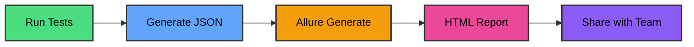

# <twemoji-rocket/> Boosting Your Team's Clarity

## in Test Automation with <span class="text-glow font-bold text-yellow-400">Allure Reporting</span>

<div class="absolute bottom-10 left-10 text-left">
  <p class="text-xl opacity-80">Anastasios Tilsizoglou</p>
  <p class="text-sm opacity-60">Senior SDET @ Chubb</p>
  <p class="text-xs opacity-50">~7 years in test automation</p>
</div>

<div class="abs-br m-6 flex gap-2">
  <a href="https://github.com/tasostilsi" target="_blank" alt="GitHub"
    class="text-xl icon-btn opacity-50 !border-none !hover:text-white">
    <carbon-logo-github />
  </a>
</div>

<!--
For those of you who don't know me, my name is **Anastasios Tilsizoglou**, aka **Tasos Tilsi**. I have been working in the capacity of Senior Software Engineer for **7 years of experience** in the role.

*(pause, smile)*

7 years in test automation... That's 7 years of hearing "it works on my machine" — approximately 47,000 times. And 7 years of developers looking at me like I personally offended their entire family tree when I find a bug. And let's not forget the classics: "works as designed" — which is just developer way of saying for "I don't want to fix it." And "not reproducible" — which essentially means "I tried once and gave up."

*(pause)*

But to be fair — I've been on the other side too. I've been the developer saying "it's not a bug, it's a feature." So now, as an SET, when a developer tells me "I made a small change, no need to test" — I know that's EXACTLY when I need to test everything. At least Twice if not more. Because I've *been* that developer.

*(wait for laughs)*

So, enough about my *colorful* career, and without further ado, let's move on with my presentation which revolves around **"Boosting Your Team's Clarity in Test Automation with Allure Reporting."**

However, before we delve into the presentation, let's discuss and not ignore...
-->

---
layout: center
class: text-center
---


<!--
...the **elephant in the room**.

**[Pause for effect, let the image sink in]**
-->

---
layout: center
class: text-center
---

# <twemoji-elephant class="text-yellow-400"/> The Elephant in the Room

<div class="text-2xl mt-10 mb-8 font-bold text-yellow-300">
What is the biggest challenge your team faces<br/>with test result visibility?
</div>

<div class="flex justify-center">
  
</div>

<p class="mt-6 text-sm opacity-70">Scan to share your answer</p>

<!--
At this point, please take out your phones and scan the QR code. Whatever you type in will shortly appear on the screen.

**[Wait 20-30 seconds for responses]**

The question is: **"What is the biggest challenge your team faces with test result visibility?"**

**If signal issues:**
If the signal is not letting you through and the pages are not loading, we'll go with a show of hands instead.

**After collecting responses:**
*(Read out some interesting responses)*

These are all very real challenges. And here's the thing — many of these can actually be addressed with the right reporting tool. That's exactly what we're going to explore today.

But first, let me get a sense of where everyone is at...
-->

---
layout: center
class: text-center
---

# <fa6-solid-user-check/> Your Experience

<div class="text-2xl mt-10 mb-8 font-bold text-yellow-300">
What is your experience level with Allure Reporting?
</div>

<div class="space-y-4 text-xl">
<p><fa6-solid-question class="text-gray-400"/> Never heard of it</p>
<p><fa6-solid-ear-listen class="text-blue-400"/> Heard of it but never used it</p>
<p><fa6-solid-flask class="text-yellow-400"/> Tried it a bit</p>
<p><fa6-solid-star class="text-green-400"/> Use it regularly</p>
</div>

<div class="flex justify-center mt-8">
  
</div>

<p class="mt-6 text-sm opacity-70">Scan to share your experience</p>

<!--
Before I share my story, I'd like to get a quick grasp at your experience level with no other than... Allure Reporting.

Please scan the QR code again and let me know:
- Have you **never heard of it**?
- **Heard of it** but never used it?
- **Tried it** a bit?
- Or do you **use it regularly**?

**[Wait for responses]**

**OPTION A: Mostly "Never heard of it" / "Heard but never used"**
Perfect! So most of you are new to Allure. That's exactly why I'm here today. I was in the same position a few years ago, and I want to share how discovering Allure transformed our testing workflow. Let me tell you a story...

**OPTION B: Mixed responses (some beginners, some experienced)**
Great, we have a nice mix! For those who haven't used Allure yet — you're in for a treat. And for those who already use it — maybe you'll pick up a few new tricks or validate some of your practices. Let me take you through my journey...

**OPTION C: Mostly "Tried it" / "Use it regularly"**
Excellent! Many of you already have hands-on experience. That's fantastic. I'll still share my story because context matters, and we might have some advanced tips that even experienced users find valuable. Plus, I'd love to hear your experiences in the Q&A. So, let me tell you how I got started...

**OPTION D: Completely split / Unclear**
Interesting distribution! Whether you're new to Allure or a seasoned user, there's something here for everyone. The story I'm about to tell you will resonate regardless of your experience level...
-->

---
layout: two-cols
---

# <fa6-solid-chart-pie/> Current Tools?

<div class="mt-10">

### Which tools are you using?

- <fa6-solid-terminal class="text-gray-400"/> Console Logs
- <fa6-solid-file-code class="text-blue-400"/> Default framework reports
- <fa6-solid-chart-bar class="text-green-400"/> Extended Reports
- <fa6-solid-server class="text-purple-400"/> ReportPortal
- <fa6-solid-fire class="text-orange-400"/> Allure reports
- <fa6-solid-ellipsis class="text-yellow-400"/> Other

</div>

::right::

<div class="flex items-center justify-center h-full">
  
</div>

<!--
Now, one more quick poll. **Which reporting tools are you currently using?**

- Console logs?
- Default framework reports?
- Extended reports?
- ReportPortal?
- Already using Allure?
- Something else?

**[Wait for responses]**

**If mostly Console Logs / Default Reports:**
I see many of you are using console logs and default reports. I've been there. And let me tell you believe it or not — there's a better way. My story starts exactly where you are now...

**If mostly Extended Reports / ReportPortal:**
Many of you already have reporting solutions in place. That's good! But let me show you why we moved away from similar tools and what makes Allure stand out...

**If mixed:**
Variety of tools! That's typical in our industry. The challenge is finding something that works across different frameworks and teams. That's exactly the problem I faced...

**[Transition phrase]**
So let me take you back to when this all started...
-->

---
layout: center
---

# <twemoji-open-book/> Once Upon a Time...

<div class="text-center space-y-6 mt-12 text-xl">

<p><fa6-solid-rocket class="text-green-400"/> Built test automation from scratch</p>

<p><fa6-solid-code class="text-blue-400"/> Team had Playwright + TypeScript</p>

<p><fa6-solid-circle-check class="text-yellow-400"/> POCs showed good product fit</p>

</div>

<!--
**Once upon a time...** *(smile)*

When I joined my current company, I was hired specifically to **handle the api test automation from scratch**. There was nothing in place — no existing code, no testing framework, nothing. And when I say nothing I mean nothing.

The team had already done some exploration and built an initial archetype based on **Playwright with TypeScript**. They had done POCs that showed it was a good fit for our products.
-->

---
layout: center
---

# <fa6-solid-calendar-days/> Every Day...

<div class="text-center space-y-6 mt-12 text-xl">

<p><fa6-brands-java class="text-orange-400"/> Built separate <span class="text-yellow-300 font-bold">Java REST Assured</span> for API testing</p>

<p><fa6-solid-code-compare class="text-red-400"/> Two frameworks. Two languages. Two different worlds.</p>

<p><fa6-solid-question class="text-purple-400"/> Why? Because that's where my experience was</p>

</div>

<div class="text-3xl font-bold text-red-400 mt-10">
<fa6-solid-triangle-exclamation/> Spoiler Alert: Wrong decision
</div>

<!--
**Every day**, we were building and expanding our test coverage. And because of my background — I had more experience with API testing in Java — and because there was an immediate need for API tests, I made a decision.

I built a **second framework**. A separate one. Based on **Java with REST Assured**.

Two frameworks. Two languages. Two entirely different worlds.

Why? Because that's where my expertise was.

*(Pause, then point to the spoiler alert)*

**Spoiler alert:** It was the wrong decision.
-->

---
layout: center
class: text-center
---

# <fa6-solid-bolt class="text-yellow-400"/> Until One Day...

<div class="text-9xl font-bold text-yellow-400 my-8">
1200+
</div>

<div class="space-y-4 text-xl">

<p><fa6-solid-clock/> After 1 year: needed to migrate all tests</p>

<p><fa6-solid-arrow-right/> Java REST Assured → Playwright TypeScript</p>

<p><fa6-solid-lightbulb class="text-yellow-400"/> Should have built on existing archetype</p>

</div>

<!--
**Until one day...** about a year later... we realized something.

*(Pause, point at the big number)*

**1,200+ tests.**

That's how many tests we had to migrate. From Java REST Assured back to Playwright TypeScript.

From the very beginning — we should have built on the existing archetype from the start. We should have extended Playwright's capabilities for API testing instead of creating a separate framework.

But here's the thing — that wasn't even our biggest problem...

We had bigger fish to fry!
-->

---
layout: center
---

# <fa6-solid-bug/> The REAL Problem

<p class="text-xl italic text-blue-300 text-center mb-8">It wasn't just about frameworks...</p>

<div class="space-y-5 text-lg">

<p><fa6-solid-file-lines class="text-gray-400"/> ReportNG for Java, default Playwright reports</p>

<p><fa6-solid-magnifying-glass class="text-red-400"/> Neither was good for investigating failures</p>

<p><fa6-solid-users-slash class="text-orange-400"/> Neither was readable for managers</p>

<p><fa6-solid-link-slash class="text-yellow-400 font-bold"/> No unified way to update Jira automatically</p>

</div>

<div class="text-2xl font-bold text-red-400 text-center mt-10">
<fa6-solid-eye-slash/> Teams, managers, stakeholders — all blind
</div>

<!--
**The REAL problem** wasn't about frameworks or languages.

It was about **visibility**.

*(Go through each point)*

- We had **ReportNG** for Java, and **default Playwright reports** for the other framework
- **Neither** provided good support for investigating failures — just basic information
- **Neither** was readable for managers — try sending those reports to stakeholders
- And here's the kicker: we wanted to **automatically update Jira** with test results

But with two frameworks in two languages, we'd have to build and maintain that integration **twice**.

Teams, managers, stakeholders — **everyone was in the dark**.
-->

---
layout: center
---

# <fa6-solid-map/> Because of That... We Searched

<div class="mt-8 space-y-4 text-lg">

<p><fa6-solid-check class="text-green-400"/> Works with Java and TypeScript/Playwright</p>

<p><fa6-solid-check class="text-green-400"/> Easy to investigate test failures</p>

<p><fa6-solid-check class="text-green-400"/> Visual and stakeholder-friendly</p>

<p><fa6-solid-check class="text-green-400"/> Standardized output for automation</p>

<p><fa6-solid-check class="text-green-400"/> Open-source and well-supported</p>

</div>

<div class="absolute bottom-10 right-10 text-6xl opacity-20">
<fa6-solid-compass/>
</div>

<!--
**Because of that**, we started searching for a solution.

We needed something that:
- Works with **both Java AND TypeScript/Playwright**
- Makes it **easy to investigate** test failures
- Is **visual and stakeholder-friendly**
- Provides **standardized output** we could use for automation
- Is **open-source** and well-supported

And after some research, we eventually found it...
-->

---
layout: two-cols
---

# <fa6-solid-wand-magic-sparkles/> What is Allure?

<div class="mt-4">

### *"A flexible, lightweight test report tool"*

<div class="mt-8 space-y-3">

<p><fa6-solid-puzzle-piece class="text-purple-400"/> Framework-agnostic</p>

<p><fa6-solid-palette class="text-pink-400"/> Beautiful, interactive HTML</p>

<p><fa6-solid-circle-info class="text-blue-400"/> Rich test execution details</p>

<p><fa6-solid-list-ol class="text-green-400"/> Step-by-step breakdown</p>

<p><fa6-solid-paperclip class="text-yellow-400"/> Attachments support</p>

<p><fa6-solid-chart-line class="text-orange-400"/> Historical trends</p>

</div>
</div>

::right::

<div class="flex items-center justify-center h-full">
  
</div>

<!--
**Allure Report.**

A flexible, lightweight test report tool that checked every single box.

*(Go through features)*

- **Framework-agnostic** — works with Playwright, Java, Jest, Cypress, you name it
- **Beautiful, interactive HTML** — managers actually enjoy looking at these reports
- **Rich test execution details** — everything you need to debug
- **Step-by-step breakdown** — see exactly what happened and where
- **Attachments support** — screenshots, logs, videos
- **Historical trends** — track quality over time
-->

---
layout: center
class: text-center
---

# <fa6-solid-diagram-project/> How Allure Works

<div class="flex justify-center mt-4 mb-6">



</div>

<div class="grid grid-cols-3 gap-4 text-center px-20">
<div class="bg-green-500/20 p-4 rounded-lg border border-green-500/30">
  <fa6-solid-play class="text-3xl text-green-400 mb-2"/>
  <p class="text-sm font-semibold">Execute Tests</p>
</div>
<div class="bg-blue-500/20 p-4 rounded-lg border border-blue-500/30">
  <fa6-solid-file-code class="text-3xl text-blue-400 mb-2"/>
  <p class="text-sm font-semibold">Collect Results</p>
</div>
<div class="bg-orange-500/20 p-4 rounded-lg border border-orange-500/30">
  <fa6-solid-chart-bar class="text-3xl text-orange-400 mb-2"/>
  <p class="text-sm font-semibold">Beautiful Report</p>
</div>
</div>

<!--
The beauty of Allure is its **simplicity**.

*(Walk through the diagram)*

1. You **run your tests** as normal
2. Allure generates **JSON result files**
3. You run `allure generate`
4. Out comes a **beautiful HTML report**
5. **Share it** with your team

That's it. No complex setup, no black magic.
-->

---
layout: center
---

# <fa6-solid-layer-group/> Key Features

<div class="grid grid-cols-2 gap-8 mt-10">
<div>

### <fa6-solid-list-check class="text-green-400"/> For Engineers
- Detailed step execution
- Screenshot attachments
- Log file integration
- Video recordings
- Network traffic capture

</div>
<div>

### <fa6-solid-chart-pie class="text-blue-400"/> For Managers
- Visual dashboards
- Pass/Fail trends
- Flaky test detection
- Duration analytics
- Historical comparison

</div>
</div>

<!--
What I love about Allure is that it serves **two audiences** equally well.

**For Engineers:**
- Detailed step execution
- Screenshot attachments
- Log file integration
- Video recordings
- Network traffic capture

**For Managers:**
- Visual dashboards they actually understand
- Pass/fail trends over time
- Flaky test detection
- Duration analytics
- Historical comparison
-->

---

# <fa6-solid-image/> Allure Dashboard Example

<div class="mt-8 space-y-6">

### <fa6-solid-chart-line class="text-yellow-400"/> Live Demo

<div class="bg-blue-500/20 p-6 rounded-lg border-2 border-blue-400">
  <p class="text-2xl mb-4">🔗 Check out a real Allure Report:</p>
  <a href="https://allure-examples.github.io/jest-npm-cjs-js/13/index.html" target="_blank" class="text-blue-300 text-xl underline hover:text-blue-200">
    allure-examples.github.io
  </a>
</div>

### <fa6-solid-list-check class="text-green-400"/> What You'll See:

<div class="grid grid-cols-2 gap-4 text-lg">
<div>

- 📊 Overview Dashboard
- 📈 Graphs & Trends
- 🧪 Test Suites

</div>
<div>

- ⏱️ Timeline View
- 📎 Attachments
- 🔍 Detailed Steps

</div>
</div>

</div>

<!--
Don't just take my word for it. Let me show you a **real Allure report**.

*(If time permits, click the link and do a quick walkthrough)*

You can see:
- The overview dashboard
- Graphs and trends
- Test suites breakdown
- Timeline view
- Attachments
- Detailed steps

*(If short on time)*
The link is there — I encourage you to explore it after the session.
-->

---
layout: two-cols
---

# <fa6-solid-code/> Setup: Step 1

### <fa6-solid-download class="text-green-400"/> Install Dependencies

```bash
# Install Allure reporter
npm install --save-dev \
  @playwright/test allure-playwright
```

<div class="mt-6">
<fa6-solid-circle-info class="text-blue-400"/> Works with Playwright, Jest, Cypress, and more!
</div>

::right::

<div class="mt-20">

### <fa6-solid-puzzle-piece/> Supported Frameworks

<div class="space-y-3 mt-6">

- <fa6-brands-node-js class="text-green-500"/> Playwright
- <fa6-solid-check class="text-yellow-500"/> Jest
- <fa6-solid-check class="text-cyan-500"/> Cypress
- <fa6-solid-code class="text-orange-500"/> Selenium
- <fa6-brands-java class="text-red-500"/> JUnit/TestNG

</div>
</div>

<!--
Setting up Allure is **straightforward**. Let me walk you through it quickly.

**Step 1: Install**

```bash
npm install --save-dev @playwright/test allure-playwright
```

Works with Playwright, Jest, Cypress, Selenium, JUnit, TestNG, and more!
-->

---

# <fa6-solid-gear/> Setup: Step 2

### <fa6-solid-file-code class="text-blue-400"/> Configure playwright.config.ts

```typescript
export default defineConfig({
  reporter: [
    ['allure-playwright', {
      outputFolder: 'allure-results'
    }]
  ],
  // ... other config
});
```

<div class="mt-6 grid grid-cols-2 gap-4">
<div class="bg-blue-500/20 p-3 rounded">
  <fa6-solid-folder class="text-blue-400"/> Results stored in <code>allure-results/</code>
</div>
<div class="bg-green-500/20 p-3 rounded">
  <fa6-solid-circle-check class="text-green-400"/> Auto-captures screenshots & logs
</div>
</div>

<!--
**Step 2: Configure** your playwright.config.ts to use the allure reporter.

```typescript
export default defineConfig({
  reporter: [
    ['allure-playwright', {
      outputFolder: 'allure-results'
    }]
  ],
  // ... other config
});
```

Results are stored in `allure-results/` and it auto-captures screenshots and logs.
-->

---

# <fa6-solid-terminal/> Setup: Step 3

### <fa6-solid-play class="text-green-400"/> Generate & View Report

```bash
# Run your tests
npx playwright test

# Generate report
allure generate allure-results -o allure-report

# Open in browser
allure open allure-report
```

<div class="mt-6 flex gap-4">
<div class="flex-1 bg-purple-500/20 p-4 rounded">
  <fa6-solid-rocket class="text-2xl text-purple-400 mb-2"/>
  <p class="text-sm">Auto-opens in browser</p>
</div>
<div class="flex-1 bg-pink-500/20 p-4 rounded">
  <fa6-solid-globe class="text-2xl text-pink-400 mb-2"/>
  <p class="text-sm">Interactive & searchable</p>
</div>
<div class="flex-1 bg-orange-500/20 p-4 rounded">
  <fa6-solid-share-nodes class="text-2xl text-orange-400 mb-2"/>
  <p class="text-sm">Easy to share</p>
</div>
</div>

<!--
**Step 3: Generate and View**

```bash
# Run your tests
npx playwright test

# Generate report
allure generate allure-results -o allure-report

# Open in browser
allure open allure-report
```

Three steps. That's all it takes to get started.

Auto-opens in browser, interactive and searchable, easy to share.
-->

---
layout: center
class: text-center
---

# <fa6-solid-graduation-cap/> Quiz Time!

<div class="text-2xl mt-10 mb-8 font-bold text-yellow-300">
Which annotation is used to add a custom label in an Allure report?
</div>

<div class="space-y-4 text-xl">
<p><fa6-solid-a class="text-blue-400"/> @allure.step</p>
<p><fa6-solid-b class="text-green-400"/> @allure.label</p>
<p><fa6-solid-c class="text-yellow-400"/> @allure.description</p>
<p><fa6-solid-d class="text-purple-400"/> @allure.link</p>
</div>

<div class="flex justify-center mt-8">
  
</div>

<!--
Quick **quiz time**! Let's see if you've been actually paying attention.

**Which annotation is used to add a custom label in an Allure report?**

A) @allure.step
B) @allure.label
C) @allure.description
D) @allure.link

*(Wait for responses)*

The answer is... **B) @allure.label**!

Though honestly, you'll use all of these in a real project.
-->

---
layout: two-cols
---

# <fa6-solid-cloud/> CI/CD Integration

### <fa6-brands-github class="text-purple-400"/> GitHub Actions Example

```yaml
name: Run Tests
run: npx playwright test

name: Generate Allure Report
run: allure generate allure-results

name: Publish Report
uses: peaceiris/actions-gh-pages@v3
```

::right::

<div class="mt-20">

### <fa6-solid-trophy class="text-yellow-400"/> Benefits

<div class="space-y-4 mt-8">

<p><fa6-solid-check class="text-green-400"/> Historical trends across builds</p>

<p><fa6-solid-check class="text-green-400"/> Automatic report hosting</p>

<p><fa6-solid-check class="text-green-400"/> Easy sharing with team</p>

</div>
</div>

<!--
Of course, Allure integrates beautifully with **CI/CD pipelines**.

Here's a simple GitHub Actions example. You can run your tests, generate the report, and publish it to GitHub Pages.

This gives you **historical trends** across builds, **automatic hosting**, and **easy sharing**.
-->

---
layout: center
---

# <fa6-solid-bolt-lightning/> Real Impact

<div class="grid grid-cols-2 gap-12 mt-12">
<div>

### <fa6-solid-xmark class="text-red-400"/> Before Allure
<div class="mt-6 space-y-3 text-lg opacity-70">
<p><fa6-solid-clock/> ~3-10 minutes to identify issue</p>
<p><fa6-solid-terminal/> Dig through console logs</p>
<p><fa6-solid-question/> Unclear failure reasons</p>
<p><fa6-solid-users-slash/> Managers in the dark</p>
</div>

</div>
<div>

### <fa6-solid-check class="text-green-400"/> After Allure
<div class="mt-6 space-y-3 text-lg">
<p><fa6-solid-rocket class="text-green-400"/> 2 min to identify issue</p>
<p><fa6-solid-image class="text-blue-400"/> Visual screenshots + logs</p>
<p><fa6-solid-list-check class="text-yellow-400"/> Clear step-by-step trace</p>
<p><fa6-solid-chart-pie class="text-purple-400"/> Stakeholder dashboards</p>
</div>

</div>
</div>

<div class="text-center mt-10 text-3xl font-bold">
<fa6-solid-arrow-down class="text-yellow-400"/> <span class="text-green-400">Up to 80% faster</span> debugging!
</div>

<!--
Let me share the **real impact** we experienced.

**Before Allure:**
- ~3-10 minutes to identify an issue
- Dig through console logs
- Unclear failure reasons
- Managers completely in the dark

**After Allure:**
- **2 minutes** to identify an issue
- Visual screenshots and logs right there
- Clear step-by-step trace
- Stakeholder dashboards everyone can read

That's **up to 80% faster** debugging.

But more importantly — everyone on the team finally had **clarity**.
-->

---

# <fa6-solid-lightbulb/> Advanced Features

<div class="grid grid-cols-2 gap-6 mt-8">
<div class="bg-gradient-to-br from-purple-500/20 to-pink-500/20 p-6 rounded-lg">

### <fa6-solid-tags class="text-purple-400"/> Categorization
- Custom labels
- Feature tagging
- Severity levels
- Owner assignment

</div>
<div class="bg-gradient-to-br from-blue-500/20 to-cyan-500/20 p-6 rounded-lg">

### <fa6-solid-shuffle class="text-blue-400"/> Flaky Tests
- Auto-detection
- Retry tracking
- Success rate %
- Historical patterns

</div>
<div class="bg-gradient-to-br from-green-500/20 to-emerald-500/20 p-6 rounded-lg">

### <fa6-solid-link class="text-green-400"/> Integrations
- Jira issues
- Test case links
- Documentation
- Bug trackers

</div>
<div class="bg-gradient-to-br from-orange-500/20 to-red-500/20 p-6 rounded-lg">

### <fa6-solid-chart-gantt class="text-orange-400"/> Timeline View
- Parallel execution
- Thread visualization
- Duration breakdown
- Bottleneck detection

</div>
</div>

<!--
For those who want to go deeper, Allure has **advanced features**:

- **Categorization** — custom labels, feature tagging, severity levels, owner assignment
- **Flaky test detection** — auto-detection, retry tracking, success rate %, historical patterns
- **Integrations** — Jira issues, test case links, documentation, bug trackers
- **Timeline view** — parallel execution, thread visualization, duration breakdown, bottleneck detection

Remember our Jira integration problem? With Allure's standardized output, we built **one microservice** that works for both frameworks.
-->

---
layout: center
class: text-center
---

# <fa6-solid-square-poll-vertical/> Which feature do you find most useful?

<div class="grid grid-cols-2 gap-4 mt-8 text-lg">
<div>

- <fa6-solid-list-check class="text-green-400"/> Step-by-step execution
- <fa6-solid-paperclip class="text-blue-400"/> Attachments (screenshots/logs)
- <fa6-solid-shuffle class="text-yellow-400"/> Flaky test detection

</div>
<div>

- <fa6-solid-cloud class="text-purple-400"/> CI/CD integration
- <fa6-solid-chart-pie class="text-pink-400"/> Visual dashboards
- <fa6-solid-chart-line class="text-orange-400"/> History and Trends Analysis

</div>
</div>

<div class="flex justify-center mt-8">
  
</div>

<!--
So, **which feature do you find most useful?**

- Step-by-step execution?
- Attachments (screenshots/logs)?
- Flaky test detection?
- CI/CD integration?
- Visual dashboards?
- History and Trends Analysis?

*(Collect responses and comment on popular choices)*
-->

---

# <fa6-solid-trophy/> Why Choose Allure

<div class="grid grid-cols-2 gap-6 mt-8">
<div class="bg-blue-500/20 p-5 rounded-lg border-l-4 border-blue-400">

### <fa6-solid-code class="text-blue-400"/> For Engineers
- Faster debugging (up to 80% faster)
- Step-by-step execution
- Easy to add custom info

</div>
<div class="bg-green-500/20 p-5 rounded-lg border-l-4 border-green-400">

### <fa6-solid-users class="text-green-400"/> For Teams
- Framework-agnostic
- Historical trends
- Flaky test tracking

</div>
<div class="bg-purple-500/20 p-5 rounded-lg border-l-4 border-purple-400">

### <fa6-solid-user-tie class="text-purple-400"/> For Managers
- Clear visual reports
- Understandable metrics
- CI/CD integration

</div>
<div class="bg-orange-500/20 p-5 rounded-lg border-l-4 border-orange-400">

### <fa6-solid-heart class="text-orange-400"/> For Everyone
- Open-source and free
- Active community
- Extensible & customizable

</div>
</div>

<!--
To summarize — **why choose Allure?**

- **For Engineers:** Faster debugging (up to 80% faster), step-by-step execution, easy to add custom info
- **For Teams:** Framework-agnostic, historical trends, flaky test tracking
- **For Managers:** Clear visual reports, understandable metrics, CI/CD integration
- **For Everyone:** Open-source and free, active community, extensible and customizable
-->

---
layout: center
class: text-center
---

# <fa6-solid-graduation-cap/> Final Quiz!

<div class="text-2xl mt-10 mb-8 font-bold text-yellow-300">
Which command is used to open the Allure HTML report?
</div>

<div class="space-y-4 text-xl">
<p><fa6-solid-a class="text-blue-400"/> allure serve</p>
<p><fa6-solid-b class="text-green-400"/> npx playwright test</p>
<p><fa6-solid-c class="text-yellow-400"/> allure open</p>
<p><fa6-solid-d class="text-purple-400"/> npm run report</p>
</div>

<div class="flex justify-center mt-8">
  
</div>

<!--
One last quiz!

**Which command is used to open the Allure HTML report?**

A) allure serve
B) npx playwright test
C) allure open
D) npm run report

*(Wait for responses)*

The answer is **C) allure open**!

Though `allure serve` is also useful — it generates AND opens in one command.
-->

---
layout: center
class: text-center
---

# <fa6-solid-chart-simple/> One More Thing...

<div class="text-2xl mt-10 mb-8">
Do you plan to implement Allure in your project?
</div>

<div class="space-y-4 text-xl">
<p><fa6-solid-check class="text-green-400"/> Yes, immediately!</p>
<p><fa6-solid-clock class="text-yellow-400"/> Yes, but need to plan</p>
<p><fa6-solid-lightbulb class="text-orange-400"/> Maybe, need more info</p>
<p><fa6-solid-xmark class="text-red-400"/> No, not right now</p>
<p><fa6-solid-question class="text-purple-400"/> Already using it!</p>
</div>

<div class="flex justify-center mt-8">
  
</div>

<!--
**One more thing...** I'm curious.

Do you think we can address the elephant in the room, now that you got an idea of allure reporting?

Do you plan to implement Allure in your project?

- Yes, immediately!
- Yes, but need to plan
- Maybe, need more info
- No, not right now
- Already using it!

*(Comment on responses)*

For those saying "need more info" — please catch me after the session. I'm happy to discuss your specific use case.
-->

---
layout: center
background: 'https://images.unsplash.com/photo-1451187580459-43490279c0fa?w=1920&q=80'
class: text-center
---

# <twemoji-party-popper/> Thank You!

<div class="mt-12 space-y-6 text-xl">

<p><fa6-brands-github class="text-2xl"/> <a href="https://github.com/tasostilsi" target="_blank" class="text-blue-400 hover:text-blue-300 underline">github.com/tasostilsi</a></p>

<p><fa6-solid-globe class="text-2xl"/> <a href="https://tasostilsi.github.io" target="_blank" class="text-blue-400 hover:text-blue-300 underline">tasostilsi.github.io</a></p>

<p><fa6-solid-envelope class="text-2xl"/> Let's connect and build better test automation together!</p>

</div>

<div class="mt-12 flex justify-center gap-8 text-5xl">
<fa6-solid-heart class="text-red-400"/>
<fa6-solid-code class="text-blue-400"/>
<fa6-solid-rocket class="text-green-400"/>
</div>

<!--
And that brings us to the end.

**Thank you** for your time and attention!

If you want to connect:
- **GitHub:** github.com/tasostilsi
- **Website:** tasostilsi.github.io

I'm also happy to answer any questions you have — whether it's about Allure, test automation in general, or that migration story.

And on this note, I leave you with one key takeaway to remember:
Let's connect and **build better test automation** and all this entails, starting today!

*(Open for Q&A)*
-->

